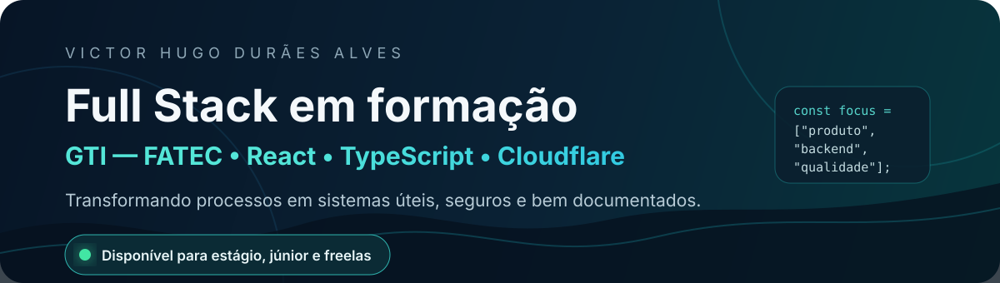
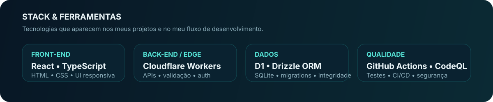
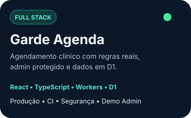
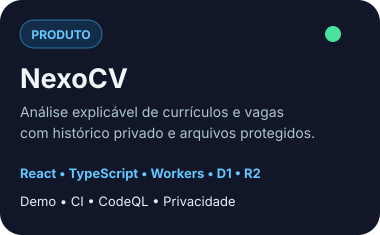
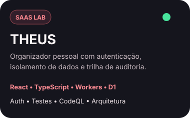

<div align="center">
  
</div>

<br />

## Sobre mim

Sou **Técnico em Administração** e graduando em **Gestão da Tecnologia da Informação pela FATEC**. Estou construindo minha carreira em tecnologia com foco em desenvolvimento web e soluções que conectam **produto, processos, backend, dados e segurança**.

Gosto de transformar problemas práticos em aplicações utilizáveis — não apenas telas. Nos meus projetos, procuro documentar decisões, validar regras no backend, automatizar qualidade com CI e deixar claras as limitações de cada solução.

> **Objetivo atual:** oportunidades de estágio/júnior em tecnologia e projetos freelance de desenvolvimento web e suporte.

<div align="center">
  <a href="mailto:vduraesalves1122@gmail.com"></a>
  <a href="https://www.linkedin.com/in/victor-hugo-dur%C3%A3es-alves-300bb32b7/"></a>
  <a href="https://github.com/hashickzvictorhugo?tab=repositories"></a>
</div>

<br />

<div align="center">
  
</div>

## Projetos em destaque

<div align="center">
  <a href="https://clinica-teste-agendamentos.hashickzvictorhugo.workers.dev"></a>
  &nbsp;
  <a href="https://nexocv-vagas.duraesalvesvictorhug.chatgpt.site"></a>
  &nbsp;
  <a href="https://theus-organizador.duraesalvesvictorhug.chatgpt.site"></a>
</div>

<div align="center"><sub>Clique nos cards para abrir as demonstrações.</sub></div>

### Garde Agenda

**Case Full Stack de agendamento clínico** com múltiplos profissionais, regras de disponibilidade, bloqueio de conflitos, feriados, Cloudflare D1, área administrativa protegida e modo demo somente leitura para avaliação.

[Produção](https://clinica-teste-agendamentos.hashickzvictorhugo.workers.dev) · [Código](https://github.com/hashickzvictorhugo/Cl-nica-Teste---Est-gio)

### NexoCV

Aplicação para **comparar currículo e descrição de vaga** com diagnóstico explicável, histórico privado, processamento de PDF/DOCX e persistência em D1/R2. O motor de análise é determinístico e documentado.

[Demo](https://nexocv-vagas.duraesalvesvictorhug.chatgpt.site) · [Código](https://github.com/hashickzvictorhugo/Curriculo)

### THEUS

Organizador pessoal full stack para **tarefas, notas e compromissos**, com autenticação, isolamento entre usuários, sessão administrativa protegida, auditoria, migrations e testes comportamentais de segurança.

[Demo](https://theus-organizador.duraesalvesvictorhug.chatgpt.site) · [Código](https://github.com/hashickzvictorhugo/Sistema-de-Agendamento-Agenda-Theus)

## Como eu penso engenharia

```text
Problema real
   ↓
Regra de negócio clara
   ↓
Interface simples + API protegida
   ↓
Persistência e integridade dos dados
   ↓
Testes + CI + análise de segurança
   ↓
Deploy + documentação + limites conhecidos
```

Nos projetos recentes, tenho praticado:

- **frontend tipado e responsivo** com React e TypeScript;
- **APIs e execução serverless/edge** em Cloudflare Workers;
- **dados relacionais** com D1/SQLite e Drizzle ORM;
- **segurança defensiva**, autenticação, autorização e minimização de dados;
- **CI/CD**, lint, typecheck, testes, build, CodeQL e Dependabot;
- documentação de **arquitetura, regras, trade-offs e roadmap**.

## GitHub em números

<div align="center">
  <picture>
    <source media="(prefers-color-scheme: dark)" srcset="https://github-profile-summary-cards.vercel.app/api/cards/stats?username=hashickzvictorhugo&theme=github_dark" />
    <source media="(prefers-color-scheme: light)" srcset="https://github-profile-summary-cards.vercel.app/api/cards/stats?username=hashickzvictorhugo&theme=github" />
    
  </picture>
  &nbsp;
  <picture>
    <source media="(prefers-color-scheme: dark)" srcset="https://github-profile-summary-cards.vercel.app/api/cards/repos-per-language?username=hashickzvictorhugo&theme=github_dark" />
    <source media="(prefers-color-scheme: light)" srcset="https://github-profile-summary-cards.vercel.app/api/cards/repos-per-language?username=hashickzvictorhugo&theme=github" />
    
  </picture>
</div>

## Tecnologias

<div align="center">
  
</div>

<br />

<div align="center">
  <strong>React • TypeScript • HTML/CSS • Cloudflare Workers • D1 • Drizzle ORM • Git/GitHub • GitHub Actions</strong>
</div>

## Contato

<div align="center">
  <p>Se quiser conversar sobre uma oportunidade, projeto ou freela, pode me chamar.</p>
  <a href="mailto:vduraesalves1122@gmail.com"><strong>E-mail</strong></a>
  &nbsp;•&nbsp;
  <a href="https://www.linkedin.com/in/victor-hugo-dur%C3%A3es-alves-300bb32b7/"><strong>LinkedIn</strong></a>
  &nbsp;•&nbsp;
  <a href="https://github.com/hashickzvictorhugo"><strong>GitHub</strong></a>
</div>

---

<div align="center"><sub>Perfil construído para mostrar não só código, mas produto, decisões técnicas e evolução contínua.</sub></div>
